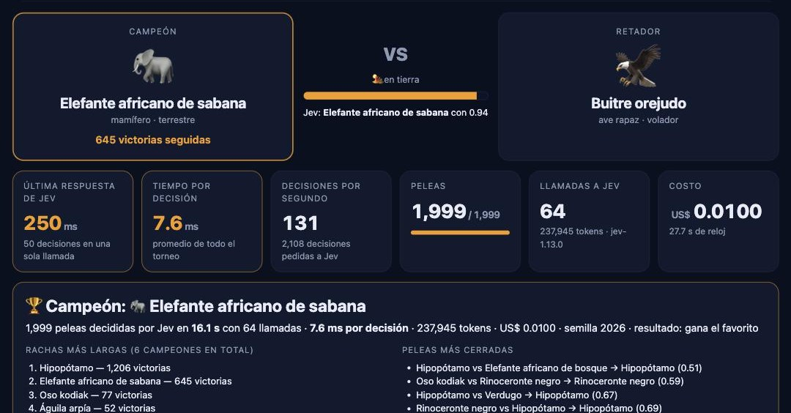
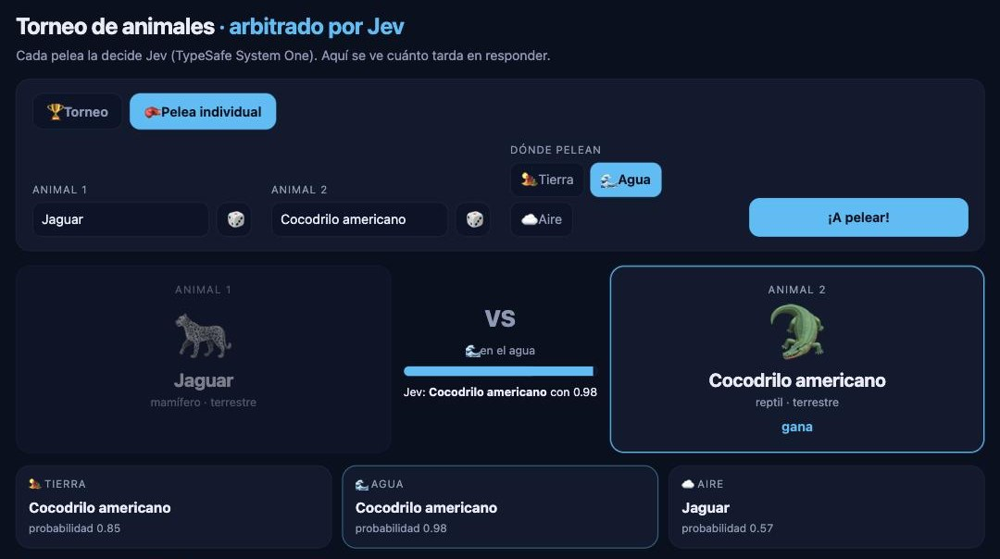

# Animal Tournament, refereed by Jev

A small local game built to *feel* how fast [Jev](https://docs.typesafe.ai/introduction) — TypeSafe's System One model — makes typed decisions.
Up to 2,569 animals (land, flying and marine) fight one on one; **the winner stays on** and faces the next challenger until one champion is left. Every fight is decided by Jev.

> 🇪🇸 The game UI, the animal list and the prompts are in Spanish — *[instrucciones en español](LEEME.md)*. In our tests Jev handled Spanish prompts as well as English ones.



**Measured on a laptop:** 2,000 animals → **1,999 fights in ~16 s**, 64 API calls, **~7.6 ms per decision**, ~US$0.01. A single hand-picked duel returns in ~220 ms — and that one call already answers who wins on land, in water *and* in the air.

## Quick start

No dependencies — Python 3.10+ standard library only. You need your own TypeSafe API key ([console.typesafe.ai](https://console.typesafe.ai/settings/keys), early access).

```bash
git clone https://github.com/hectorlcastro09/jev-torneo-animales.git
cd jev-torneo-animales
cp .env.example .env        # then paste your key into .env   (Windows: copy .env.example .env)
python3 app.py              # opens http://127.0.0.1:8777      (Windows: python app.py)
```

On macOS you can also double-click `Torneo Jev.command`. Prefer a terminal? `python3 torneo.py --n 300 --arena agua --semilla 7`.

The key never leaves your machine except to call TypeSafe: a tiny local server (127.0.0.1 only) keeps it and talks to Jev, because the TypeSafe API does not accept cross-origin browser calls and a key must not live in a web page.

## What you can play with

- **Tournament** — set how many land / flying / marine animals enter (the total is the sum), pick the arena (**land**, **water**, **air**, or a random arena per fight), the speed (*turbo*: one call decides up to 50 fights; *fight by fight*: one call per fight, to watch real per-answer latency) and the outcome rule (*favourite wins*, or *with chance*: the game rolls a die loaded with Jev's probability, so upsets happen).
- **Single fight** — pick any two animals; one request asks all three arenas in both option orders (6 decisions) and averages the two orders.



## How it works

- `motor.py` — arena rules, a dependency-free Jev client, and the tournament as an event generator.
  - The arena rules go in `state`; each fight is one `choice` question whose two options are the animal names.
  - **Speculative fan-out:** one request asks "current champion vs. each of the next K challengers". Code walks the answers in order and, the moment the champion falls, throws the rest away (they were about the old champion). K grows with the champion's streak, because a fresh champion tends to fall soon.
  - A small shared pool of keep-alive HTTPS connections, warmed at start-up.
- `app.py` — local server that streams every fight to the page as it is decided (Server-Sent Events). `web/index.html` is the whole UI.
- `animales.csv` — 2,569 animals with type and class; edit it freely.

## What this taught us about Jev

- **It reads literally.** "Avión zapador" is a bird (sand martin), but *avión* means aeroplane: 0.56 against a rhino. Presenting every animal with its class — "Avión zapador (ave; animal volador)" — raised it to 0.75.
- **Mild position bias.** The option listed first gains about 0.1 (tiger vs. grizzly: 0.84 → 0.93 when swapped), so the order is shuffled per fight and the single-fight mode averages both orders.
- **`state` really drives the answer.** Lion vs. great white shark: lion 1.00 on land, shark 1.00 in water.
- **The probabilities behave like probabilities.** Replaying one 300-animal draw "with chance" produced 23 upsets where the probabilities predicted 20.7; with "favourite wins" there were none.
- **Reuse the connection.** A fresh TLS handshake per call (~0.3 s) was hiding Jev's speed: a 6-decision request went from ~500 ms to ~200 ms.

## Tests

```bash
python3 -m unittest discover -s tests -v
```

Offline: Jev is replaced by a deterministic fake referee. The tests fail if the winner-stays-on chain breaks, if speculative answers stop being discarded, if per-type quotas or seeding change, or if the single fight stops cancelling position bias.

## How this was built

AI-assisted, and openly so: the game idea, rules, feature requests and play-testing are Héctor Castro's; the code was written by Claude (Anthropic's Claude Code) under his direction. Improvements and pull requests are welcome.

## License

[MIT](LICENSE)
